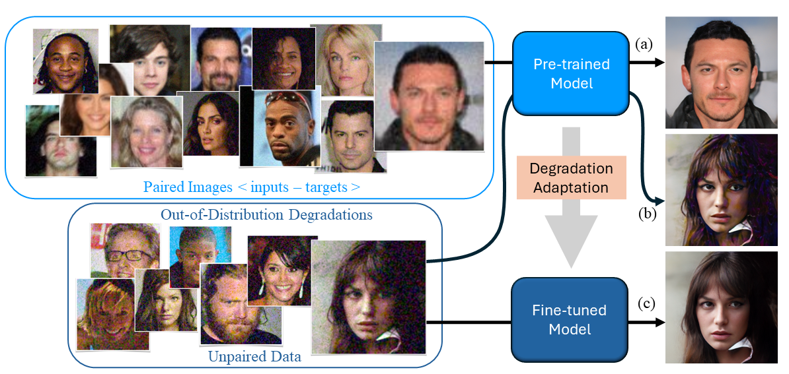

# Towards Unsupervised Blind Face Restoration using Diffusion Prior

Tianshu Kuai, Sina Honari, Igor Gilitschenski, and Alex Levinshtein


[**Project**](https://tianshukuai.github.io/) | [**Paper**](https://tianshukuai.github.io/)





---

## Getting Started

Create a new conda environment using the provided `environment.yml` file:
```
# Install conda environment
conda env create -f environment.yml
conda activate Diff_tuned_BFR
```

Download pre-trained models:
```
bash misc/download_weights.sh
```

## Dataset Preparation

Download the entire [FFHQ dataset](https://github.com/NVlabs/ffhq-dataset) for the adversarial loss during fine-tuning. Prepare the dataset by following the procedure [here](https://github.com/zsyOAOA/DifFace?tab=readme-ov-file#testing) to save the images into size of `512x512`.

### Synthetic Dataset
To reproduce our results on synthetic dataset, download the [CelebA-Test dataset](https://xinntao.github.io/projects/gfpgan) (Both HQ and LQ). We provide script to generate our synthetic dataset described in the paper. Place the high-quality (512x512) face images in a directory and run:
```
# to be added
```

### Real-world Dataset

We use the entire [Wider-Test](https://shangchenzhou.com/projects/CodeFormer/) for fine-tuning the pre-trained model. To evaluate the fine-tuned model, download our [Wider-Test-200](https://tianshukuai.github.io/). Note that our `Wider-Test-200` does not contain images in the `Wider-Test` dataset.


## Generating Pseudo Targets

### SwinIR
Generate pseudo targets for pre-trained SwinIR:
```
# define paths
input_dir=data/celeba-raw-noise-4x-iso-1500/train_lq
output_dir=data/celeba-raw-noise-4x-iso-1500/train_targets

# generate pseudo targets for SwinIR
bash scripts/generate_targets_general.sh input_dir output_dir 16
# argv[1]: low-quality inputs
# args[2]: output directory for pseudo targets
# argv[3]: downsampling factor for low pass filter
```

---

### CodeFormer or any pre-trained restoration model
Generate pseudo targets for any pre-trained restoration model (you can replace the CodeFormer inference with another pre-trained restoration model):
```
# define paths
input_dir=../data/celeba-raw-noise-4x-iso-3000/train_lq
pretrained_results_dir=../data/celeba-raw-noise-4x-iso-3000/codeformer

# run CodeFormer
cd CodeFormer
python inference_codeformer.py -w 0.5 --has_aligned --input_path $input_dir --output_path $pretrained_results_dir 
cd ..

# define paths
pretrained_results_dir=data/celeba-raw-noise-4x-iso-3000/codeformer
output_dir=data/celeba-raw-noise-4x-iso-3000/train_targets_codeformer

# generate pseudo targets
bash scripts/generate_targets_general.sh $pretrained_results_dir $output_dir 16
# argv[1]: pre-trained restoration model outputs
# args[2]: output directory for pseudo targets
# argv[3]: downsampling factor for low pass filter
```

## Fine-tuning using Pseudo Targets

### SwinIR
Prepare a config file for fine-tuning by following the example config [here](./configs/main/swinir_gan.yaml). To illustrate the procedure for fine-tuning, we use it as an example:
```
config=configs/main/swinir_gan.yaml
log_dir=logs/swinir_gan_finetune

python train.py --cfg_path $config --save_dir $log_dir
```

---

### CodeFormer
Prepare a config file for fine-tuning by following the example config [here](./CodeFormer/options/codeformer_finetune.yml). To illustrate the procedure for fine-tuning, we use it as an example:
```
cd CodeFormer
python finetune.py -opt options/codeformer_finetune.yml
cd ..
```

## Evaluation

The results are saved as `.txt` files inside the corresponding `$results_dir`.

### SwinIR

#### Synthetic Datasets
```
# define paths
test_inputs=data/celeba-raw-noise-4x-iso-1500/test_lq
results_dir=results/swinir_finetune
gt_dir=data/CelebA-Test-split/test_gt

# run fine-tuned model on testing set
python run_swinir.py --in_path $test_inputs --out_path $results_dir --ckpt_path $log_dir/ckpts/model_latest.pth

# run evaluation
bash scripts/eval_synthetic.sh $results_dir $gt_dir
# argv[1]: results
# args[2]: gt images
```

#### Real-world Datasets
```
# define paths
test_inputs=data/Wider-Test-200
results_dir=results/swinir_finetune_wider-test-200

# run fine-tuned model on testing set
python run_swinir.py --in_path $test_inputs --out_path $results_dir --ckpt_path $log_dir/ckpts/model_latest.pth

# run evaluation
bash scripts/eval_real.sh $results_dir
# argv[1]: results
```

---

### CodeFormer
#### Synthetic Datasets
```
# define paths
test_inputs=../data/celeba-raw-noise-4x-iso-3000/test_lq
results_dir=../results/codeformer_finetune
gt_dir=data/CelebA-Test-split/test_gt

# run fine-tuned model on testing set
cd CodeFormer
python inference_codeformer.py -w 0.5 --has_aligned --input_path $test_inputs --output_path $results_dir --ckpt $Finetuned_CodeFormer_ckpt
cd ..

# run evaluation
bash scripts/eval_synthetic.sh $results_dir $gt_dir
# argv[1]: results
# args[2]: gt images
```

#### Real-world Datasets
```
# define paths
test_inputs=../data/Wider-Test-200
results_dir=../results/codeformer_finetune_wider-test-200

# run fine-tuned model on testing set
cd CodeFormer
python inference_codeformer.py -w 0.5 --has_aligned --input_path $test_inputs --output_path $results_dir --ckpt $Finetuned_CodeFormer_ckpt
cd ..

# run evaluation
bash scripts/eval_real.sh $results_dir
# argv[1]: results
```


## Pre-training

To pre-train your own SwinIR on synthetic dataset generated by commonly used degradation pipeline as in other blind face restoration papers:
```
# define paths
config=configs/others/swinir_gan_pretrain.yaml
log_dir=logs/swinir_gan_pretrain

python train.py --cfg_path $config --save_dir $log_dir
```

For prefer to pre-training the Codeformer, please refer to their official implementation [here](https://github.com/sczhou/CodeFormer). We use the released checkpoint from CodeFormer authors as pre-trained model.


## Acknowledgement

## Citation
If you find this project useful in your work, please consider citing it:
```
@inproceedings{kuai2024towards,
    author={Kuai, Tianshu and Honari, Sina and Gilitschenski, Igor and Levinshtein, Alex},
    title={Towards Unsupervised Blind Face Restoration using Diffusion Prior},
    booktitle={arXiv},
    year={2024},
}
```